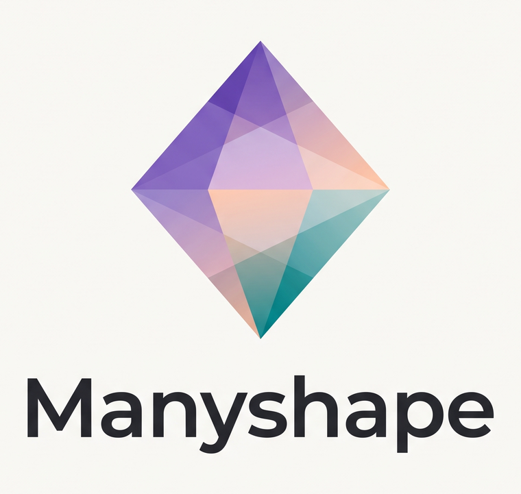

  

# Manyshape

**Make apps in many shapes.** *(manyshape.com)*

Manyshape is a software delivery stack where applications ship as **capability contracts** - schemas, actions, policies, and reference UI - and every user's AI compiles a personal interface on top. Developers ship the primitives; users' AI builds the product.

> **▶ Try the live demo:** [demo.manyshape.com](https://demo.manyshape.com) - reshape a mail app in real time. Two flavors: [vanilla](https://demo.manyshape.com/?fw=vanilla) and [React](https://demo.manyshape.com/?fw=react). Still early - expect rough edges.

This is the hub: the concept, the [architecture](ARCHITECTURE.md), the [documentation](docs/), and links to the component repositories. The code lives in the repos below.

## Repositories

| Repo | What |
|---|---|
| [manyshape-sdk](https://github.com/Them-labs/manyshape-sdk) | `@manyshape/sdk` - vendor SDK: capability contracts + the authority-plane router |
| [manyshape-surface-sdk](https://github.com/Them-labs/manyshape-surface-sdk) | `@manyshape/surface-sdk` - the in-sandbox `facet` API + the React (Preact) runtime |
| [manyshape-chat-sdk](https://github.com/Them-labs/manyshape-chat-sdk) | `@manyshape/chat-sdk` - the embeddable customization bubble for vendor apps |
| [manyshape-agent](https://github.com/Them-labs/manyshape-agent) | `@manyshape/agent` - the interface agent (surface compiler) |
| [manyshape-extension](https://github.com/Them-labs/manyshape-extension) | Chrome extension - reshape any app that ships or registers a contract |
| [manyshape-examples](https://github.com/Them-labs/manyshape-examples) | Example app: a mail app shipped as a capability contract, with the runtime |
| [manyshape-website](https://github.com/Them-labs/manyshape-website) | The marketing site + docs ([manyshape.com](https://manyshape.com)) |

## The idea in one minute

Every application secretly contains three things fused together. Manyshape unfuses them:

1. **Authority plane** (vendor-owned, closed, hosted): services, data, business logic, and enforcement. Never ships to the user. All permissions and invariants are enforced here - *below* the interface.
2. **Contract plane** (vendor-shipped, signed, versioned): a machine-readable package of the app's primitives - schemas, typed capabilities, policies, design tokens, conformance tests. This is what the user's AI reads instead of source code.
3. **Surface plane** (user-owned, generated, disposable): the interface itself - a derived artifact compiled from `contract × user intent × context`, regenerated at will.

Two things fall out of this split:

- **Security stops depending on the UI.** Generated interfaces are untrusted by construction; they can only act through capability handles the authority plane checks server-side. A hallucinated surface can render anything but can *do* nothing the contract doesn't permit.
- **Customization survives updates.** Users never fork source. Their setup is an **intent spec** - a durable description of what they want - so when the vendor ships contract v2, the runtime recompiles each user's surface against it. Upgrades become migrations, not merge conflicts.

Read the [full architecture](ARCHITECTURE.md), or start with the [documentation](docs/index.md).

## Cooperative by design

Manyshape only reshapes apps whose vendor ships or registers a capability contract. It does not reverse-engineer, scrape, or remix third-party apps without permission - the extension reshapes a page client-side, as the signed-in user, on data they can already see (the ad-blocker / userstyle footing), and only when a contract is present.

---

Manyshape is built and stewarded by **Them Labs, Inc.** Contributions welcome - see [CONTRIBUTING.md](CONTRIBUTING.md). License: [MIT](LICENSE).
